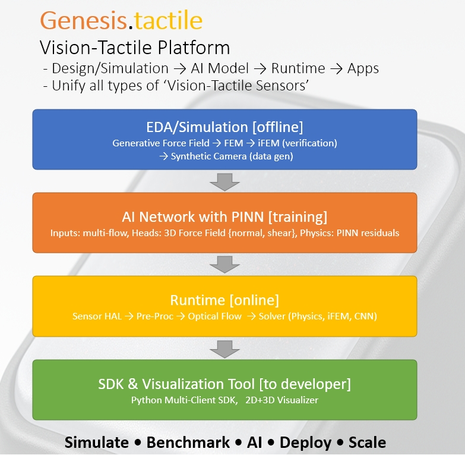
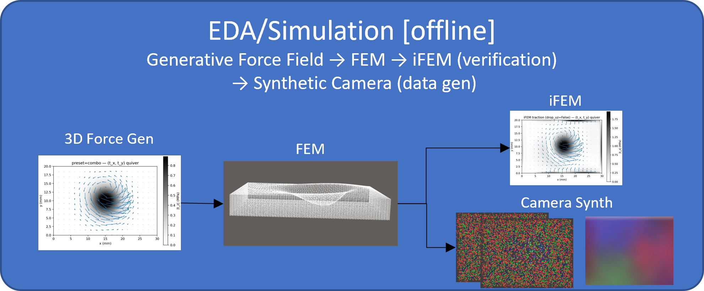
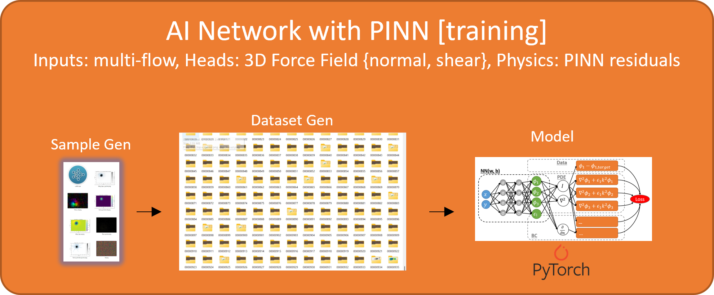
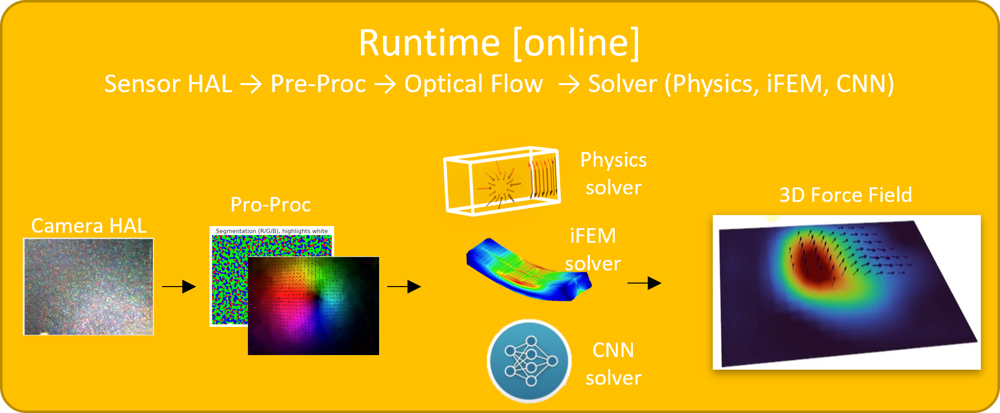
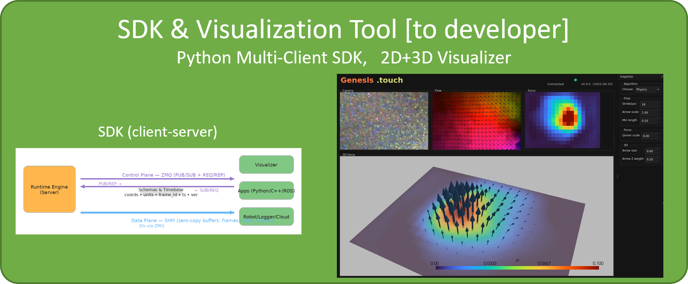

# Genesis.tactile — Vision‑Tactile Platform

**Design EDA → AI Model → Real‑Time Runtime** • Unify different types of camera‑based “vision‑tactile” sensors  
**Goals:** *Simulate • Benchmark • AI • Deploy • Scale*

---

## TL;DR

**Genesis.tactile** is a **Vision‑Tactile Platform** that takes you from **sensor design & simulation** to **AI training** to a **production‑ready runtime** and **developer SDK**.  

The goal of Vision-Tactile runtime to reconstruct **dense 3D force fields** (pressure + shear) from camera observations of soft tactile sensors—**in real time**—and provides a common interface that **unifies different vision‑tactile sensor types**.

<p align="center">
  
  <br><em>Figure 1 — Platform overview.</em>
</p>

---

## What’s inside (4 components)

## Platform Components

| Component | Illustration | Description |
|-----------|--------------|-------------|
| **1. EDA / Simulation (offline)** |  | Generative **force-field** → **FEM** → **iFEM** (verification) → **synthetic camera image** supports several types of sensor design. |
| **2. Dataset & AI Training** |  | Sample generators, dataset builders, ai model (CNN) with PINN physics-guided residual losses, and training pipelines. |
| **3. Runtime (online)** |  | Sensor HAL → preprocessing → optical flow → **solvers** (physics, iFEM, CNN) → **3D force field** at interactive rates. |
| **4. SDK & Visualizer** |  | Multi-client SDK to subscribe to force fields, plus **2D/3D visualizer** for inspection, debugging, and demos. |


---

## Quick links

- **Design&Simulation**: [`src/`](src/) → 3D force field generators, FEM, iFEM, synthetic camera observations
- **Runtime (service)**: [`runtime/`](runtime/) → configs, deployment, metrics
- **SDK (client API)**: [`sdk/`](sdk/) → Python API, examples
- **Apps & Visualizer**: [`apps/`](apps/) → 2D+3D viewer

---

## Highlights

- **End‑to‑end**: design & simulate → auto‑generate datasets → train AI → deploy.  
- **Physics‑aware AI**: CNN/PINN heads for **pressure** and **shear**, with physical residuals.  
- **Unified platform**: common runtime + SDK across vision‑tactile sensor types.  
- **Realtime**: camera → pre‑proc → flow → solver → **3D force field** stream.  
- **Dev‑friendly**: simple SDK; reference **2D/3D visualizer** out of the box.  

---

## Repository layout & stability

```text
.
├── src/       # research & EDA: force-field gen, FEM/iFEM, synthetic camera, dataset generation, ai model training
├── runtime/   # product-ready real-time service
├── sdk/       # developer SDKs and stable APIs
└── app/       # 2D/3D visualizer reference applications
```

---

## Citation

If you use Genesis.touch in your research, please cite:

```bibtex
@software{genesis_touch_2025,
  title        = {Genesis.tactile — Vision–Tactile Platform},
  author       = {Yue Fei},
  year         = {2025},
  version      = {0.9.0},
  url          = {https://github.com/existenz98/genesis-tactile.git}
}
```

